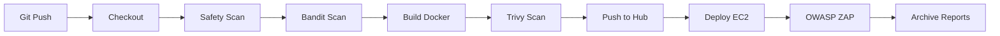

# CSC11004 DA3 - DevSecOps CI/CD Pipeline

## Mô Tả Dự Án

Dự án triển khai **hệ thống CI/CD có kiểm thử bảo mật (DevSecOps pipeline)** cho ứng dụng Flask đơn giản. Pipeline tích hợp đầy đủ các công cụ SAST (Static Application Security Testing) và DAST (Dynamic Application Security Testing).

## Điểm Nổi Bật

- **6 Security Scanning Tools**: Bandit, Safety, Trivy, OWASP ZAP
- **Full CI/CD Automation**: GitHub → Jenkins → Docker Hub → AWS EC2
- **Comprehensive Security Reports**: JSON, HTML, visual dashboards
- **Production Deployment**: Automated deployment với security checks
- **Industry Standards**: OWASP, CWE, CVE compliance

## Cấu Trúc Project

```
DA3/
├── app.py                      # Flask application
├── Dockerfile                  # Container configuration
├── Jenkinsfile                 # DevSecOps pipeline definition
├── requirements.txt            # Python dependencies
├── .bandit                     # Bandit security config
├── .trivyignore               # Trivy ignore rules
└── README.md                  # This file
```

## Security Pipeline Stages

### SAST - Static Analysis
1. **Safety**: Dependency vulnerability scanning
2. **Bandit**: Python security linting

### Container Security
4. **Trivy**: Docker image vulnerability scanning

### DAST - Dynamic Analysis
5. **OWASP ZAP**: Penetration testing on running app

## Quick Start

### 1. Clone Repository
```bash
git clone https://github.com/22127477/CSC11004_DA3_22127477.git
cd DA3
```

### 2. Setup Jenkins
- Install plugins: Docker Pipeline, SSH Agent, HTML Publisher
- Configure credentials:
  - `docker-hub-credentials`: Docker Hub username/password
  - `aws-ec2-key`: AWS EC2 SSH key

### 3. Configure Pipeline
- Create new Pipeline job in Jenkins
- Point to `Jenkinsfile` in this repository
- Update `AWS_IP` in Jenkinsfile to your EC2 instance

### 4. Run Pipeline
```bash
# Manual trigger in Jenkins UI
# Or push to GitHub (with webhook configured)
git add .
git commit -m "Trigger DevSecOps pipeline"
git push origin main
```

## Security Reports

Sau khi pipeline chạy, xem reports tại:

```
Jenkins > Build #XX > Artifacts > security-reports/
├── bandit-report.json       # Python security issues
├── safety-report.json       # Dependency vulnerabilities
├── trivy-report.json        # Container vulnerabilities
├── zap-report.html         # DAST findings (interactive)
└── zap-report.json         # DAST findings (JSON)
```

## Tools Used

| Tool | Purpose | Type | Documentation |
|------|---------|------|---------------|
| **Bandit** | Python security linting | SAST | [Link](https://bandit.readthedocs.io/) |
| **Safety** | Dependency vulnerability scan | SAST | [Link](https://pyup.io/safety/) |
| **Trivy** | Container image scanning | Container Security | [Link](https://aquasecurity.github.io/trivy/) |
| **OWASP ZAP** | Dynamic penetration testing | DAST | [Link](https://www.zaproxy.org/docs/) |

## Documentation

Xem **[DevSecOps_README.md](DevSecOps_README.md)** để biết:
- Chi tiết từng stage trong pipeline
- Hướng dẫn cài đặt và cấu hình
- Troubleshooting common issues
- Metrics và best practices
- Security policy

Xem **[SECURITY.md](SECURITY.md)** để biết:
- Security measures implemented
- Vulnerability severity levels
- Reporting security issues
- Compliance standards

## Đáp Ứng Yêu Cầu Bài Tập

### SAST (Static Application Security Testing)
- **Bandit**: Phân tích code Python tìm lỗ hổng bảo mật
- **Safety**: Quét dependencies tìm CVEs

### DAST (Dynamic Application Security Testing)
- **OWASP ZAP**: Penetration testing ứng dụng đang chạy
- Kiểm tra XSS, SQL Injection, Security Headers, etc.

### Container Security
- **Trivy**: Quét Docker image tìm vulnerabilities
- Kiểm tra OS packages và application dependencies

### CI/CD Integration
- Tích hợp vào Jenkins pipeline
- Automated security scans mỗi lần build
- Security reports archive
- Non-blocking scans (không dừng pipeline khi tìm thấy warning)

### Production Deployment
- Deploy lên AWS EC2
- Chỉ deploy images đã được scan
- DAST testing sau khi deploy

## Screenshots

### Pipeline Overview
```
┌─────────────────────────────────────────────────┐
│  Checkout → SAST → Build → Scan → Push         │
│           → Deploy → DAST → Archive             │
│  Duration: ~6-10 minutes                        │
│  Security Scans: 7 tools                        │
└─────────────────────────────────────────────────┘
```

### Security Findings Example
```
Bandit: 0 HIGH, 2 MEDIUM, 5 LOW
Safety: 3 vulnerabilities in dependencies
Trivy: 1 CRITICAL, 5 HIGH, 12 MEDIUM
ZAP: 4 HIGH, 8 MEDIUM alerts
```

## Pipeline Flow



## Technology Stack

- **Application**: Python 3.9, Flask 3.0
- **Containerization**: Docker
- **CI/CD**: Jenkins
- **Cloud**: AWS EC2
- **Registry**: Docker Hub
- **Security**: Bandit, Safety, Trivy, OWASP ZAP

## Author

- **Student ID**: 22127477
- **Course**: CSC11004 - Advanced Computer Networking
- **Project**: DA3 - DevSecOps Pipeline
- **Semester**: 2025-2026

## License

This project is for educational purposes only.

## Acknowledgments

- OWASP for security testing tools and guidelines
- Aqua Security for Trivy
- PyCQA for Bandit
- PyUp for Safety

---

**Để chạy pipeline, chỉ cần push code lên GitHub!**

```bash
git add .
git commit -m "Run DevSecOps pipeline"
git push origin main
```

Pipeline sẽ tự động:
1. Scan code và dependencies
2. Build và scan Docker image  
3. Deploy lên AWS
4. Test bảo mật ứng dụng
5. Tạo security reports

